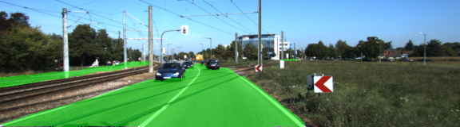
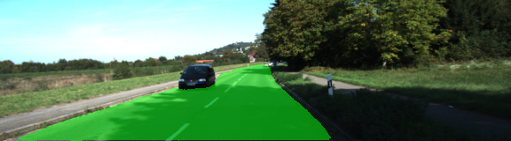
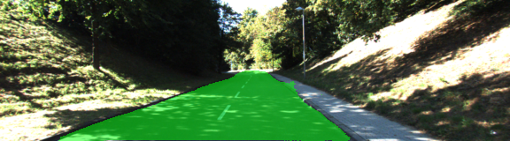
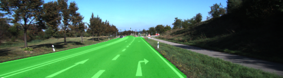

# Semantic Segmentation using Fully Convolutional Networks
In this project, we'll construct a fully convolutional neural network based on the VGGNet-16 architecture to perform semantic segmentation on a video captured from a front facing camera mounted on a vehicle dashboard to identify the drivable surface area. To achieve this task, we'll implement [Fully Convolutional Networks for Semantic Segmentation](https://people.eecs.berkeley.edu/~jonlong/long_shelhamer_fcn.pdf), a paper published by Jonathan Long, Evan Shelhamer and Trevor Darrell from UC Berkeley that adapt contemporary classification network VGGNet into fully convolutional network and transfers its learned representations by fine-tuning to the segmentation task.

## The Model
A pre-trained VGG-16 network was converted to a fully convolutional network by converting the final fully connected layer to a 1x1 convolution and setting the depth equal to the number of desired classes (in this case, two: road and not-road).

## Results
Run the following command to run the project:
```
python main.py
```
**Note**: If running this in Jupyter Notebook system messages, such as those regarding test status, may appear in the terminal rather than the notebook.

<figure>
 
</figure>

<figure>
 
</figure>

<figure>
 
</figure>

<figure>
 
</figure>

<figure>
 
</figure>

---

### Setup
##### GPU
`main.py` will check to make sure you are using GPU - if you don't have a GPU on your system, you can use AWS or another cloud computing platform.
##### Frameworks and Packages
Make sure you have the following is installed:
 - [Python 3](https://www.python.org/)
 - [TensorFlow](https://www.tensorflow.org/)
 - [NumPy](http://www.numpy.org/)
 - [SciPy](https://www.scipy.org/)
##### Dataset
Download the [Kitti Road dataset](http://www.cvlibs.net/datasets/kitti/eval_road.php) from [here](http://www.cvlibs.net/download.php?file=data_road.zip).  Extract the dataset in the `data` folder.  This will create the folder `data_road` with all the training a test images.